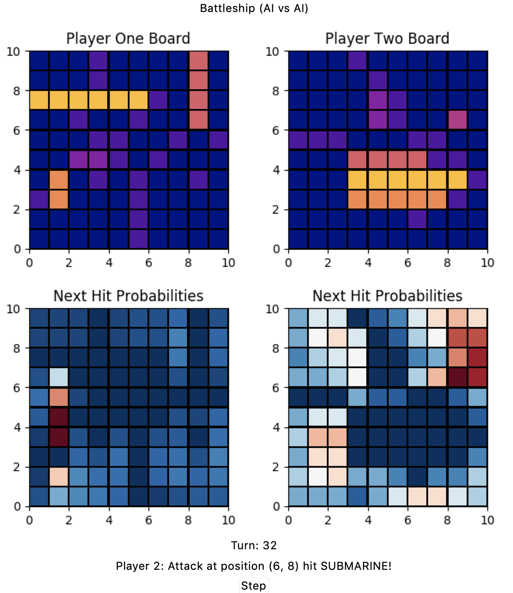

# battleshipAI
Sachal Dhillon

## Description
Visualization of 2 AIs playing a game of Battleship against each other. 

## Installation
with any python3 environment, run: 

* pip install -r requirements.txt
* python Main.py

## Usage

The display is split between two AIs denoted Player One and Player Two on the left and right side respectively. On the top half of the screen is their visualizations of the parts of the opponent's board that have been explored. 

Unexplored spaces (water) are blue and explored but empty spaces (misses) are purple. As they become revealed, the different ships are displayed with various shades of orange. Larger ships have lighter hues.

When the 'Step' button is clicked, the active player takes a turn and attempts to strike the opposing player. After this, control is handed off to the opposing player. The results of every action are displayed at the bottom above the 'Step' button. A turn is completed every 2 steps.

## Algorithm

At every step, the AI simulates all possible placements of any ship given the current known board state. The selected strike location is then the position that was present in the most valid placements.

Though this may seem computationaly intensive, the simulations are trivial on a 10x10 board. Performance can still be bounded by taking a monte-carlo approach to simulating positions if the board size or sparsity is increased. 

## Notes
Developed according to rules documented at: https://www.thesprucecrafts.com/the-basic-rules-of-battleship-411069